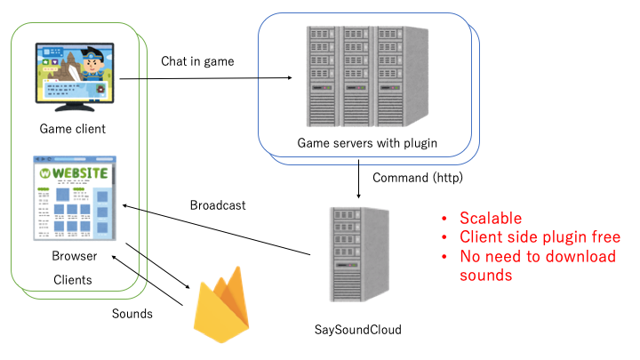

# SaySoundCloud

SaySoundCloud is a framework to build a cloud native SaySound service for many games.

## Features
* **Scalable**, it provides sounds for not only several game servers or chat services but something can talk http protocol.
* **Client side plugin free**, user just need a browser to browse it, so no need specific plugins.
* **No downloading sounds**, because the sounds is provided by SaySoundCloud, so users no need to download them.

## Contribution

The framework supports multi languages, but I can use just English and Japanese. So please add more languages, and off course welcome to join the development.
Also, please contribute to develop plugins for other applications and games.

## For Japanese speakers

SaySoundCloudはクラウド技術を使い手軽に音声を流せるサービスを作ることができるフレームワークです。

### 特徴
* **拡張性**, SaySoundCloudは1つのサービスで複数のゲームサーバをサポートします。また、利用するにはHTTPプロトコルを使い音声コマンドをアプリに送信するだけですから、ゲーム用途以外(例えばDiscordのテキストチャットを音声化するなど)の利用も可能です。
* **クライントのプラグインがいらない**, ユーザが必要なものはこのサービスを閲覧するブラウザのみです。特別なModやプラグインは必要ありません。
* **音声ファイルのダウンロードがいらない**, 音声はリアルタイムにブラウザに配信されるため、事前にファイルをダウンロードする必要がありません。

### 貢献
このフレームワークは多言語に対応していますが、現状英語と日本語にしか対応していません。他の言語を追加していただけると助かります。
また、プラグインに関しても色々なアプリケーションやゲームなど充実させていきたいと考えております。そちらについても奮って開発に参加していただけるとありがたいです。
